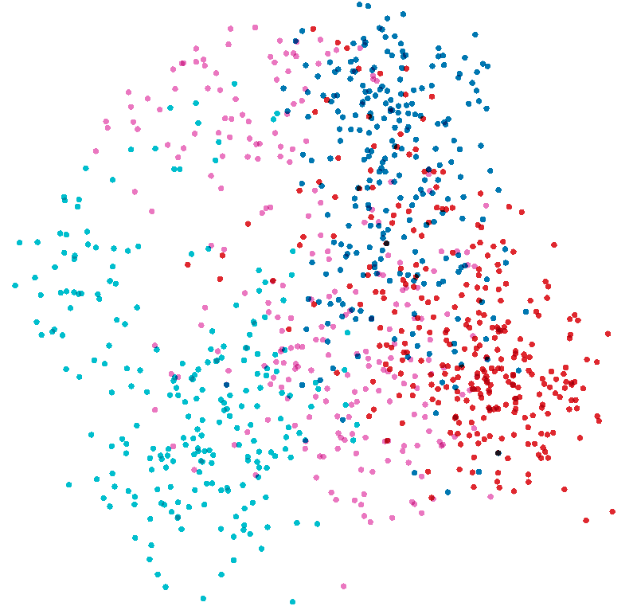
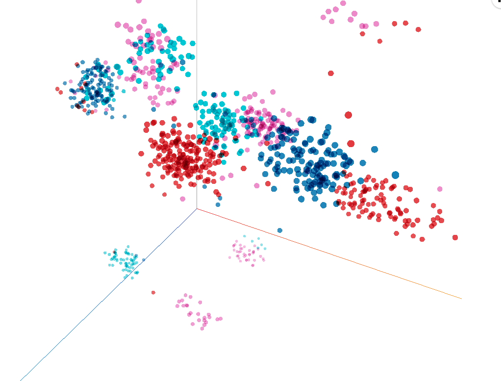
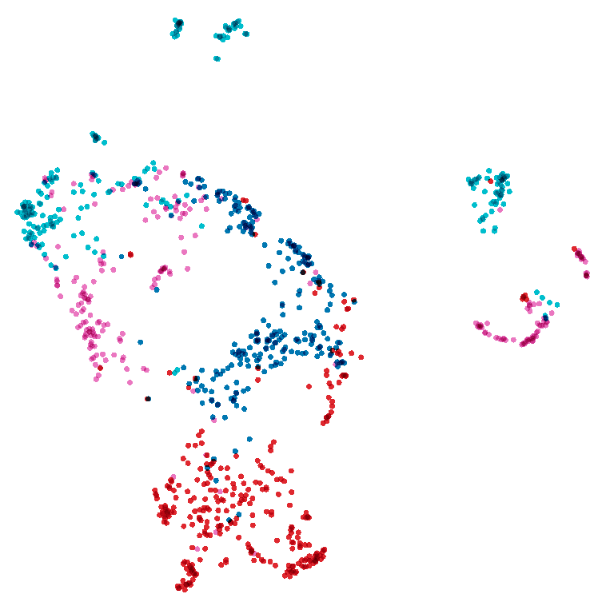
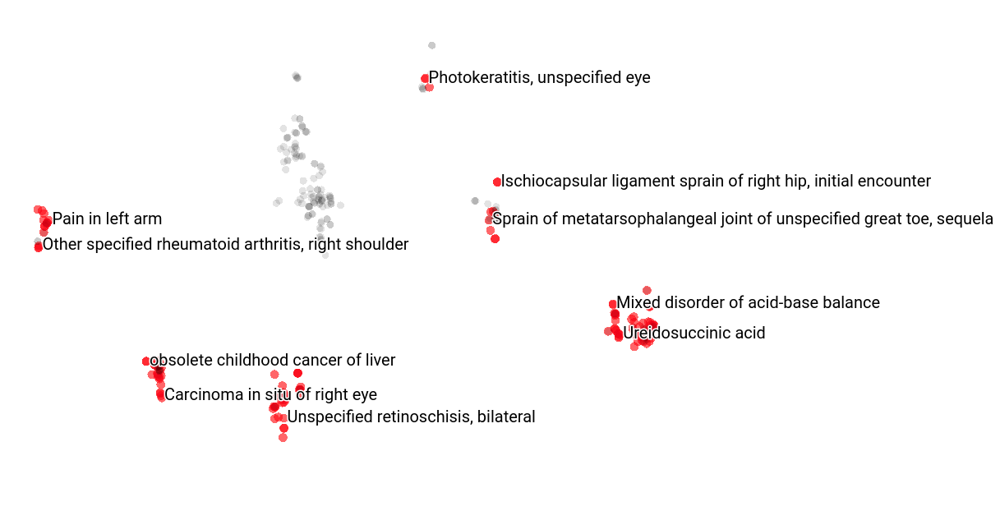

# Embeddings

Use proposed model (BioBERT) for visualization of entity embeddings through TensorBoard Projector.

For this purpose a Jupyter Notebook (*Embeddings.ipynb*) is used to ease the processing and obtainment of the embeddings jointly with its subsequent visualization in PCA, t-SNE and UMAP graphs.
An example list with a set of terms of different semantic types is provided (Chemicals, Diseases, Genes, Proteins) -> *embeddings_test.txt*

## Dependencies

In addition to the dependencies related to the model, the following dependencies are needed for visualizing the embeddings:
  - TensorBoard
  - h5py
  
The python files used for processing the embeddings were obtained from its original implementation: [BioBERT](https://github.com/dmis-lab/biobert-pytorch)

## Results
The following visualizations were obtained through this embedding processing

       
 
